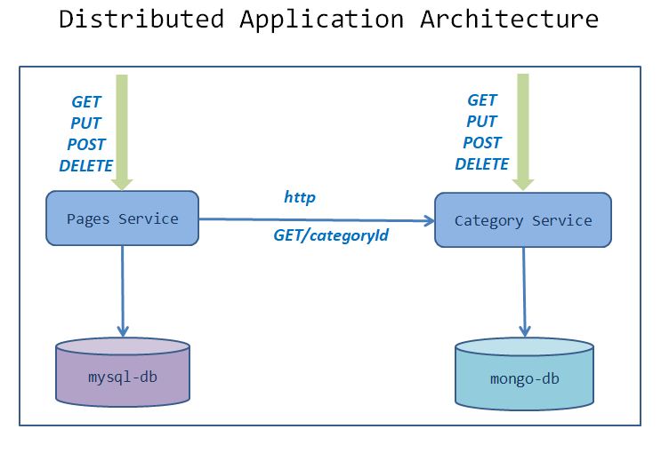
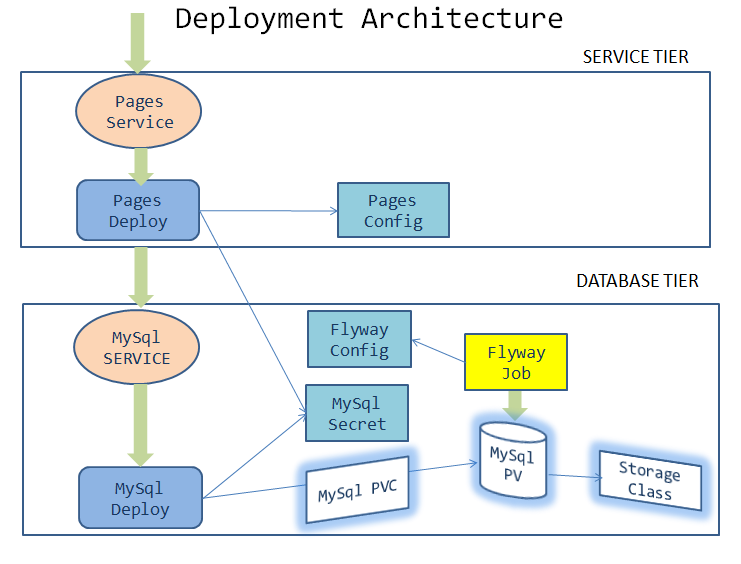

= Designing for deployment - Pages Microservice
:stylesheet: boot-flatly.css
:nofooter:
:data-uri:
:icons: font
:linkattrs:

In this lab we will look into an existing brown field `pages microservice` and deploy it to the K8s cluster.
DevOps team has been be approached by the development team after completing their sprint to deploy their code to production.
How will you deploy? What information do you need? What files do you expect to have in place in order to deploy the application?
Think through all these pointers before attacking the problem.

== Learning Outcomes
After completing the lab, you will be able to understand

. Deployment Architecture
. Design for deployment
. Deploy 2 tier application

== Understanding the high-level distributed architecture

**We will be focusing on the pages microservice in this lab. In the next lab we will deploy the category microservice **

== Development of the pages microservice

.  Docker image of pages microservice is available in the image registry. How do we tackle designing the deployment architecture? Discuss this with your pairs? What inputs do you need?
.  It is necessary to understand the configuration requirements and dependencies, if any, in order for the application to work properly once deployed.
. Let us examine the deployment architecture. The microservice is composed of a 2 tier architecture.
 In order to complete the design:
.. We will have to design the db tier and service tier
.. Look at the dependencies and figure out a way to connect the database tier with the service tier

== Designing the architecture

. Delete the contents of `~/workspace/kubernetes-manifests` directory
. Download link:https://cloud-native-labs.s3.ap-south-1.amazonaws.com/J21/tailorlabguide/pages.zip[pages microservice manifest files, window="_blank"] and extract to `~/workspace/kubernetes-manifests/pages`
. Download link:https://cloud-native-labs.s3.ap-south-1.amazonaws.com/J21/tailorlabguide/mysql.zip[mysql manifest files, window="_blank"] and extract to `~/workspace/kubernetes-manifests/mysql`
. Walkthrough the manifest files & understand the solution to the deployment architecture.
. Before we start deploying, replace `[student-name]` with your namespace in all the manifest files.

== Deploying to K8s

.  Create storage related objects in minikube
+
[source,shell script]
--------
kubectl apply -f ~/workspace/kubernetes-manifests/mysql/storage-class.yaml
kubectl apply -f ~/workspace/kubernetes-manifests/mysql/pv.yaml
kubectl apply -f ~/workspace/kubernetes-manifests/mysql/pvc.yaml

--------

+
[source,shell script]
--------
kubectl get storageclasses
kubectl get pv
kubectl get pvc
--------

.  Create configmaps,secrets and rbac
+
[source,shell script]
--------
kubectl apply -f ~/workspace/kubernetes-manifests/mysql/configmap.yaml
kubectl apply -f ~/workspace/kubernetes-manifests/mysql/secret.yaml
kubectl apply -f ~/workspace/kubernetes-manifests/pages/config.yaml
kubectl apply -f ~/workspace/kubernetes-manifests/pages/rbac.yaml
--------

.  Create all the services
+
[source,shell script]
--------
kubectl apply -f ~/workspace/kubernetes-manifests/mysql/service.yaml
kubectl apply -f ~/workspace/kubernetes-manifests/pages/service.yaml
--------
.  Create all the deployments and job in minikube
+
[source,shell script]
--------
kubectl apply -f ~/workspace/kubernetes-manifests/mysql/deployment.yaml
kubectl apply -f ~/workspace/kubernetes-manifests/mysql/flyway-job.yaml
kubectl apply -f ~/workspace/kubernetes-manifests/pages/deployment.yaml
--------

. We successfully deployed `pages` microservice application to K8s cluster.
But, does it work as expected? Test it using basic curl commands or `postman`

+
. Refer <<07-Pages-Curl-Commands.adoc#pages-curl-section, Curl Guide>> for curl testing guide

. Does GET request work?
. Does POST request work?
. Were you able to find any defects in this version of the deployment? Note down any problems that you might encounter and discuss them with your pairs to find suitable solutions

