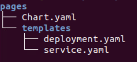

= Helmify
:stylesheet: boot-flatly.css
:nofooter:
:data-uri:
:icons: font
:linkattrs:

The DevOps team will use a basic application that was developed in one of the earlier labs and convert them into simple helm charts which
can be easily deployed to a kubernetes cluster.

== Learning Outcomes
After completing the lab, you will be able to understand

. Chart structure
. Helm concepts – Release, Revision, Chart Version
. Helm commands
. Install, Upgrade, Rollback and Delete application

=== Creating helm directory structure

. Create the directory structure as below

+

. Create `helm-charts` directory
. Verify helm is installed
. Create `templates` directory and `Chart.yaml` file.

+
[source, shell script]
------------------
mkdir ~/workspace/helm-charts
cd ~/workspace/helm-charts
helm version
mkdir pages
mkdir pages/templates
touch pages/Chart.yaml
------------------

. Update `pages/Chart.yaml` containing the name of the chart with a short description, chart version and application version

+
`pages/Chart.yaml`
+
[source, yaml]
-------------
apiVersion: v2
name: pages
description: A Helm chart for Pages Application
type: application
version: 0.1.0
appVersion: "1.0"
-------------

== Create the manifest files

. Reuse the existing manifest files for deployment and service.
Copy from the earlier lab or refer below

+
`pages/templates/deployment.yaml`

+
[source, yaml]
------------------
apiVersion: apps/v1
kind: Deployment
metadata:
  labels:
    app: pages
  name: pages
spec:
  replicas: 1
  selector:
    matchLabels:
      app: pages
  strategy: {}
  template:
    metadata:
      labels:
        app: pages
    spec:
      containers:
        - image: dellcloud/pages:1.0
          name: pages
          imagePullPolicy: IfNotPresent
          ports:
            - containerPort: 8080
------------------

+

`pages/templates/service.yaml`

+

[source, yaml]
------------------
apiVersion: v1
kind: Service
metadata:
  labels:
    app: pages
  name: pages
spec:
  ports:
  - port: 8080
    protocol: TCP
    targetPort: 8080
  selector:
    app: pages
  type: NodePort
------------------

=== Deploy using helm chart

. Before installing the helm chart create the namespace in which you want to install the chart
and set the kubectl context to point to the right namespace.

+

[source, shell script]
------------------
kubectl create ns [name-of-your-team]
kubectl config set-context --current --namespace [name-of-your-team]
------------------

. The template command helps us to see the output of the generated manifest files before installing.
Once you are satisfied with the the manifest, go ahead and install the chart in the namespace that you created.

+

[source, shell script]
------------------
helm template pages
helm install api pages --dry-run --debug
helm install api pages -n [name-of-your-team]
------------------

. Verify the installation and deployment

+

[source, shell script]
------------------
helm list
kubectl get deploy pages
kubectl get svc pages
------------------

. Test the application running in the cluster

+

[source, shell script]
------------------
kubectl port-forward svc/pages 8080:8080
curl localhost:8080
------------------

=== Upgrade

. Update the name of the image in the `deployment.yaml` to `dellcloud/pages:service`

+

[source, shell script]
------------------
helm template pages
helm upgrade api pages
helm list
kubectl get deploy pages
kubectl get pods
------------------

. Verify the `pages` deployment has updated the container image in its pods

=== Rollback

. Let us rollback to the earlier version

+
[source, shell script]
------------------
helm list
helm status api
helm rollback api
helm status api
kubectl get deploy pages
------------------

. Verify the `pages` deployment has updated the container image in its pods

=== Un-install the application

. The devops team would want to uninstall the application

+

[source, shell script]
------------------
helm list
helm uninstall api
helm list
kubectl get deploy
------------------