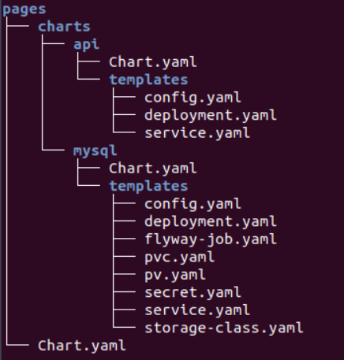

= Helmify 2 tier microservice application
:stylesheet: boot-flatly.css
:nofooter:
:data-uri:
:icons: font
:linkattrs:

The DevOps team wants to deploy a 2 tier microservice application.
The team uses an `umbrella chart` to helmify.

== Learning Outcomes
After completing the lab, you will be able to understand

. Umbrella Chart structure
. Installing umbrella chart for a microservice based application
. Transforming kubernetes manifests to helm charts

=== Deployment artifacts and manifests

image::deployment-architecture-with-storage.png[]

=== Reviewing the helm directory structure

. Since pages application will have 2 charts, the umbrella chart structure comes handy
. Before creating the umbrella chart, lets clean up the directory structure

+
[source, shell script]
------------------
rm -rf ~/workspace/helm-charts/pages/
------------------
. Create the files and directory structure as per the below `umbrella chart` structure
+

. Update `Chart.yaml` files with the name of the chart containing a short description, chart version and application version

+
`pages/Chart.yaml`
+
[source, yaml]
-------------
apiVersion: v2
name: pages
description: A Helm chart for Pages Application
type: application
version: 0.1.0
appVersion: "1.0"
-------------

+
`pages/charts/api/Chart.yaml`
+
[source, yaml]
-------------
apiVersion: v2
name: api
description: A Helm chart for Pages API
type: application
version: 0.1.0
appVersion: "1.0"
-------------

+
`pages/charts/mysql/Chart.yaml`
+
[source, yaml]
-------------
apiVersion: v2
name: mysql
description: A Helm chart for MySql
type: application
version: 0.1.0
appVersion: "1.0"
-------------

== Create the manifest files

. Create the manifest files for pages api service

+
`pages/charts/api/templates/config.yaml`
+

[source, yaml]
------------------
apiVersion: v1
data:
  PAGE_CONTENT: Green-Pages coming from Yellow-World!
kind: ConfigMap
metadata:
  name: pages
  namespace: [replace-this-with-your-namespace]

------------------
+
`pages/charts/api/templates/deployment.yaml`
+
[source, yaml]
------------------
apiVersion: apps/v1
kind: Deployment
metadata:
  labels:
    app: pages
    tier: service
  name: pages
  namespace: [replace-this-with-your-namespace]
spec:
  replicas: 1
  selector:
    matchLabels:
      app: pages
      tier: service
  strategy: {}
  template:
    metadata:
      labels:
        app: pages
        tier: service
    spec:
      containers:
        - image: dellcloud/pages:monitor
          name: pages
          imagePullPolicy: IfNotPresent
          ports:
            - containerPort: 8080
          env:
            - name: PAGE_CONTENT
              valueFrom:
                configMapKeyRef:
                  name: pages
                  key: PAGE_CONTENT
            - name: SPRING_DATASOURCE_URL
              value: jdbc:mysql://mysql/pages?useSSL=false
            - name: SPRING_DATASOURCE_USERNAME
              value: "root"
            - name: SPRING_DATASOURCE_PASSWORD
              valueFrom:
                secretKeyRef:
                  name: mysql
                  key: password
            - name: DEBUG
              value: "true"
            - name: LOGGING_FILE_NAME
              value: "[replace-this-with-your-namespace]/logs/app.log"
            - name: LOGGING_LEVEL_ORG_SPRINGFRAMEWORK_WEB
              value: debug
            - name: LOGGING_LEVEL_ROOT
              value: debug
            - name: MANAGEMENT_ENDPOINTS_WEB_EXPOSURE_INCLUDE
              value: "*"
          volumeMounts:
            - name: node-dir
              mountPath: /[replace-this-with-your-namespace]
          readinessProbe:
            tcpSocket:
              port: 8080
            initialDelaySeconds: 15
            periodSeconds: 30
          livenessProbe:
            httpGet:
              path: /actuator/health
              port: 8080
            initialDelaySeconds: 15
            periodSeconds: 30
      volumes:
        - name: node-dir
          hostPath:
            path: /[replace-this-with-your-namespace]
------------------

+
`pages/charts/api/templates/service.yaml`
+

[source, yaml]
------------------
apiVersion: v1
kind: Service
metadata:
  labels:
    app: pages
    tier: service
  name: pages
  namespace: [replace-this-with-your-namespace]
spec:
  ports:
  - port: 8080
    protocol: TCP
    targetPort: 8080
  selector:
    app: pages
    tier: service
  type: NodePort
------------------

. Create the manifest files for mysql service
+
`pages/charts/mysql/templates/config.yaml`
+
[source, yaml]
------------------
apiVersion: v1
kind: ConfigMap
metadata:
  name: mysql
  namespace: [replace-this-with-your-namespace]
data:
  spring.datasource.username: root
  V1__inital_schema.sql: |
    USE pages;
    create table pages(
    id bigint(20) not null auto_increment,
    business_name VARCHAR(50),
    address VARCHAR(50),
    category_id bigint(20),
    contact_number VARCHAR(50),
    primary key (id)
    )
    engine = innodb
    default charset = utf8;

------------------
+
`pages/charts/mysql/templates/secret.yaml`
+
[source, yaml]
------------------
apiVersion: v1
data:
  password: cGFzc3dvcmQ=
  spring.datasource.password: cGFzc3dvcmQ=
kind: Secret
metadata:
  creationTimestamp: null
  name: mysql
  namespace: [replace-this-with-your-namespace]
------------------
+
`pages/charts/mysql/templates/service.yaml`
+
[source, yaml]
------------------
apiVersion: v1
kind: Service
metadata:
  name: mysql
  namespace: [replace-this-with-your-namespace]
  labels:
    app: pages
    tier: database
spec:
  ports:
    - port: 3306
  selector:
    app: pages
    tier: database
  type: ClusterIP
------------------
+
`pages/charts/mysql/templates/pv.yaml`
+
[source, yaml]
------------------
apiVersion: v1
kind: PersistentVolume
metadata:
  name: mysql-pv-[replace-this-with-your-namespace]
  labels:
    type: local
spec:
  storageClassName: database-[replace-this-with-your-namespace]
  capacity:
    storage: 3Gi
  accessModes:
    - ReadWriteMany
  hostPath:
    path: "/var/lib/mysql/[replace-this-with-your-namespace]"
------------------
+
`pages/charts/mysql/templates/pvc.yaml`
+
[source, yaml]
------------------
apiVersion: v1
kind: PersistentVolumeClaim
metadata:
  name: mysql-pvc-[replace-this-with-your-namespace]
  namespace: [replace-this-with-your-namespace]
spec:
  storageClassName: database-[replace-this-with-your-namespace]
  accessModes:
    - ReadWriteMany
  resources:
    requests:
      storage: 1Gi
------------------
+
`pages/charts/mysql/templates/storage-class.yaml`
+
[source, yaml]
------------------
kind: StorageClass
apiVersion: storage.k8s.io/v1
metadata:
  name: database-[replace-this-with-your-namespace]
  labels:
    addonmanager.kubernetes.io/mode: EnsureExists
provisioner: k8s.io/minikube-hostpath
reclaimPolicy: Retain
volumeBindingMode: Immediate
------------------
+
`pages/charts/mysql/templates/deployment.yaml`
+
[source, yaml]
------------------
apiVersion: apps/v1
kind: Deployment
metadata:
  name: mysql
  namespace: [replace-this-with-your-namespace]
  labels:
    app: pages
    tier: database
spec:
  selector:
    matchLabels:
      app: pages
      tier: database
  strategy:
    type: Recreate
  template:
    metadata:
      labels:
        app: pages
        tier: database
    spec:
      containers:
        - image: mysql:8.0
          name: mysql
          imagePullPolicy: IfNotPresent
          env:
            - name: MYSQL_ROOT_PASSWORD
              valueFrom:
                secretKeyRef:
                  name: mysql
                  key: password
            - name: MYSQL_SERVICE_HOST
              value: "mysql"
            - name: MYSQL_SERVICE_PORT
              value: "3306"
            - name: MYSQL_DATABASE
              value: "pages"
          ports:
            - containerPort: 3306
              name: mysql
          volumeMounts:
            - name: mysql-persistent-storage
              mountPath: /var/lib/mysql
      volumes:
        - name: mysql-persistent-storage
          persistentVolumeClaim:
            claimName: mysql-pvc-[replace-this-with-your-namespace]
------------------
+
`pages/charts/mysql/templates/flyway-job.yaml`
+
[source, yaml]
------------------
apiVersion: batch/v1
kind: Job
metadata:
  name: flyway-job
  namespace: [replace-this-with-your-namespace]
  labels:
    app: pages
spec:
  template:
    spec:
      containers:
        - name: flyway
          image: flyway/flyway:6.4.4
          imagePullPolicy: IfNotPresent
          args:
            - info
            - migrate
            - info
          env:
            - name: FLYWAY_URL
              value: jdbc:mysql://mysql/pages
            - name: FLYWAY_USER
              value: root
            - name: FLYWAY_PASSWORD
              valueFrom:
                secretKeyRef:
                  name: mysql
                  key: password
            - name: FLYWAY_PLACEHOLDER_REPLACEMENT
              value: "true"
            - name: FLYWAY_PLACEHOLDERS_USERNAME
              valueFrom:
                configMapKeyRef:
                  name: mysql
                  key: spring.datasource.username
            - name: FLYWAY_PLACEHOLDERS_PASSWORD
              valueFrom:
                secretKeyRef:
                  name: mysql
                  key: spring.datasource.password
          volumeMounts:
            - mountPath: /flyway/sql
              name: sql
      volumes:
        - name: sql
          configMap:
            name: mysql
      restartPolicy: Never
------------------

=== Deploy using helm chart

. Before installing the helm chart check if your namespace exists and set the kubectl context to point to the right namespace.

+
[source, shell script]
------------------
kubectl get  ns
kubectl config get-contexts
kubectl config set-context --current --namespace [name-of-your-team]
------------------

. Install the pages application umbrella chart
+
[source, shell script]
------------------
helm template pages
helm install pagesapp pages --dry-run --debug
helm install pagesapp pages -n [name-of-your-team]
------------------

. Verify the installation and deployment
+
[source, shell script]
------------------
helm list
kubectl get deploy pages
kubectl get svc pages
------------------

. Port forward to connect to pages service running inside K8s from the local machine
+
[source, shell script]
------------------
kubectl port-forward svc/pages 8080:8080
------------------

. Test the pages application by performing CRUD operations using curl/postman.
Refer <<07-Pages-Curl-Commands.adoc#pages-curl-section, Pages Curl Guide>> for testing.

=== Task Accomplished

Devops team was successful in helmifying a 2 tier microservice application and deploying into the kubernetes cluster.

