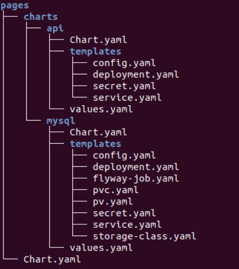

= Reusable Helm Charts using Helm Templates
:stylesheet: boot-flatly.css
:nofooter:
:data-uri:
:icons: font
:linkattrs:

The DevOps team needs to share and reuse the helm charts using helm templates.

== Learning Outcomes
After completing the lab, you will be able to understand

. Create simple, reusable helm charts using helm templates
. Overview of Helm template Engine and Data

=== Reviewing the helm directory structure

. Create the files and directory structure as per the below `umbrella chart` structure
+

+
[source, shell script]
-------------------
cd ~/workspace/helm-charts
touch pages/charts/api/values.yaml
touch pages/charts/mysql/values.yaml
touch pages/charts/api/templates/secret.yaml
-------------------

. Update `values.yaml` files with the properties to be reused in kubernetes manifest files.

+
`pages/charts/api/values.yaml`
+
[source, yaml]
-------------

deployment:
  containerPort: 8080

secrets:
  SDP: cGFzc3dvcmQ=

service:
  port: 8080
  type: NodePort
  protocol: TCP
  targetPort: 8080

imagePullPolicy: IfNotPresent
image:
  repository: dellcloud/pages
  tag: monitor

config:
  PAGE_CONTENT: Green-Pages coming from Yellow-World!

env:
  SPRING_DATASOURCE_URL: jdbc:mysql://pages-mysql/pages?useSSL=false
  SPRING_DATASOURCE_USERNAME: root
  DEBUG: true
  LOGGING_FILE_NAME: [replace-this-with-your-namespace]/logs/app.log
  LOGGING_LEVEL_ORG_SPRINGFRAMEWORK_WEB: debug
  LOGGING_LEVEL_ROOT: debug
  MANAGEMENT_ENDPOINTS_WEB_EXPOSURE_INCLUDE: "*"

volumeMounts:
  mount_path: /[replace-this-with-your-namespace]

readinessProbe:
  tcpSocket:
    port: 8080
  initialDelaySeconds: 15
  periodSeconds: 30
livenessProbe:
  httpGet:
    path: /actuator/health
    port: 8080
  initialDelaySeconds: 15
  periodSeconds: 30
-------------

+
`pages/charts/mysql/values.yaml`
+
[source, yaml]
-------------
config:
  spring_datasource_username: root

deployment:
  containerPort: 3306

secrets:
  SDP: cGFzc3dvcmQ=

service:
  port: 3306
  type: ClusterIP
  protocol: TCP
  targetPort: 3306

imagePullPolicy: IfNotPresent
image:
  repository: mysql
  tag: "8.0"

env:
  MYSQL_SERVICE_HOST: mysql
  MYSQL_SERVICE_PORT: 3306
  MYSQL_DATABASE: pages

volumeMounts:
  mountPath: /var/lib/mysql

job:
  image:
    repository: flyway/flyway
    tag: "6.4.4"
  env:
    FLYWAY_URL: jdbc:mysql://pages-mysql/pages
    FLYWAY_USER: root
    FLYWAY_PLACEHOLDER_REPLACEMENT: true

pv:
  capacity:
    storage: 3Gi
  accessMode: ReadWriteMany
  hostPath:
    path: "/var/lib/mysql/[replace-this-with-your-namespace]"
pvc:
  resources:
    requests:
      storage: 1Gi

storageClass:
  provisioner: k8s.io/minikube-hostpath
  reclaimPolicy: Delete
  volumeBindingMode: Immediate
-------------

== Create the manifest files

. Create the manifest files for pages api service

+
`pages/charts/api/templates/config.yaml`
+

[source, yaml]
------------------
apiVersion: v1
data:
  PAGE_CONTENT: {{ .Values.config.PAGE_CONTENT}}
kind: ConfigMap
metadata:
  name: {{ .Chart.Name }}
------------------
+
`pages/charts/api/templates/secret.yaml`
+

[source, yaml]
------------------
apiVersion: v1
data:
  password: {{ .Values.secrets.SDP }}
kind: Secret
metadata:
  name: {{ .Release.Name }}-{{ .Chart.Name }}
------------------
+
`pages/charts/api/templates/service.yaml`
+

[source, yaml]
------------------
apiVersion: v1
kind: Service
metadata:
  labels:
    app: {{ .Release.Name }}-{{ .Chart.Name }}
  name: {{ .Release.Name }}-{{ .Chart.Name }}
spec:
  ports:
  - port: {{ .Values.service.port }}
    protocol: {{ .Values.service.protocol }}
    targetPort: {{ .Values.service.targetPort }}
  selector:
    app: {{ .Release.Name }}-{{ .Chart.Name }}
  type: {{ .Values.service.type }}
------------------

+
`pages/charts/api/templates/deployment.yaml`
+

[source, yaml]
------------------
apiVersion: apps/v1
kind: Deployment
metadata:
  labels:
    app: {{ .Release.Name }}-{{ .Chart.Name }}
  name: {{ .Release.Name }}-{{ .Chart.Name }}
spec:
  replicas: 1
  selector:
    matchLabels:
      app: {{ .Release.Name }}-{{ .Chart.Name }}
  strategy: {}
  template:
    metadata:
      labels:
        app: {{ .Release.Name }}-{{ .Chart.Name }}
    spec:
      containers:
        - image: {{ .Values.image.repository }}:{{ .Values.image.tag }}
          name: {{ .Chart.Name }}
          imagePullPolicy: {{ .Values.imagePullPolicy }}
          ports:
            - containerPort: {{ .Values.deployment.containerPort }}
          env:
            - name: PAGE_CONTENT
              valueFrom:
                configMapKeyRef:
                  name: {{ .Chart.Name }}
                  key: PAGE_CONTENT
            - name: SPRING_DATASOURCE_URL
              value: {{ .Values.env.SPRING_DATASOURCE_URL }}
            - name: SPRING_DATASOURCE_USERNAME
              value: {{ .Values.env.SPRING_DATASOURCE_USERNAME | quote}}
            - name: SPRING_DATASOURCE_PASSWORD
              valueFrom:
                secretKeyRef:
                  name: {{ .Release.Name }}-{{ .Chart.Name }}
                  key: password
            - name: DEBUG
              value: {{ .Values.env.DEBUG | quote}}
            - name: LOGGING_FILE_NAME
              value: {{ .Values.env.LOGGING_FILE_NAME | quote}}
            - name: LOGGING_LEVEL_ORG_SPRINGFRAMEWORK_WEB
              value: {{ .Values.env.LOGGING_LEVEL_ORG_SPRINGFRAMEWORK_WEB }}
            - name: LOGGING_LEVEL_ROOT
              value: {{ .Values.env.LOGGING_LEVEL_ROOT }}
            - name: MANAGEMENT_ENDPOINTS_WEB_EXPOSURE_INCLUDE
              value: "*"
          volumeMounts:
            - name: node-dir
              mountPath: /{{ .Release.Namespace }}
          readinessProbe:
            tcpSocket:
              port: {{ .Values.readinessProbe.tcpSocket.port }}
            initialDelaySeconds: {{ .Values.readinessProbe.initialDelaySeconds }}
            periodSeconds: {{ .Values.readinessProbe.periodSeconds }}
          livenessProbe:
            httpGet:
              path: {{ .Values.livenessProbe.httpGet.path }}
              port: {{ .Values.livenessProbe.httpGet.port }}
            initialDelaySeconds: {{ .Values.livenessProbe.initialDelaySeconds }}
            periodSeconds: {{ .Values.livenessProbe.periodSeconds }}
      volumes:
        - name: node-dir
          hostPath:
            path: /{{ .Release.Namespace }}

------------------

+
`pages/charts/mysql/templates/config.yaml`
+

[source, yaml]
------------------
apiVersion: v1
kind: ConfigMap
metadata:
  name: {{ .Chart.Name }}
data:
  spring.datasource.username: {{ .Values.config.spring_datasource_username }}
  V1__inital_schema.sql: |
    USE pages;
    create table pages(
    id bigint(20) not null auto_increment,
    business_name VARCHAR(50),
    address VARCHAR(50),
    category_id bigint(20),
    contact_number VARCHAR(50),
    primary key (id)
    )
    engine = innodb
    default charset = utf8;

------------------

+
`pages/charts/mysql/templates/secret.yaml`
+

[source, yaml]
------------------
apiVersion: v1
data:
  password: {{ .Values.secrets.SDP }}
kind: Secret
metadata:
  name: {{ .Release.Name }}-{{ .Chart.Name }}
------------------

+
`pages/charts/mysql/templates/service.yaml`
+

[source, yaml]
------------------
apiVersion: v1
kind: Service
metadata:
  name: pages-mysql
  labels:
    app: {{ .Release.Name }}-{{ .Chart.Name }}
spec:
  ports:
    - port: {{ .Values.service.port }}
  selector:
    app: {{ .Release.Name }}-{{ .Chart.Name }}
  type: {{ .Values.service.type }}
------------------

+
`pages/charts/mysql/templates/storage-class.yaml`
+

[source, yaml]
------------------
kind: StorageClass
apiVersion: storage.k8s.io/v1
metadata:
  name: {{ .Release.Name }}-{{ .Chart.Name }}-{{ .Release.Namespace }}
  labels:
    addonmanager.kubernetes.io/mode: EnsureExists
provisioner: {{ .Values.storageClass.provisioner }}
reclaimPolicy: {{ .Values.storageClass.reclaimPolicy }}
volumeBindingMode: {{ .Values.storageClass.volumeBindingMode }}

------------------

+
`pages/charts/mysql/templates/pv.yaml`
+

[source, yaml]
------------------
apiVersion: v1
kind: PersistentVolume
metadata:
  name: {{ .Release.Name }}-{{ .Chart.Name }}-{{ .Release.Namespace }}
  labels:
    type: local
spec:
  storageClassName: {{ .Release.Name }}-{{ .Chart.Name }}-{{ .Release.Namespace }}
  capacity:
    storage: {{ .Values.pv.capacity.storage }}
  accessModes:
    - {{ .Values.pv.accessMode }}
  hostPath:
    path: {{ .Values.pv.hostPath.path }}

------------------

+
`pages/charts/mysql/templates/pvc.yaml`
+

[source, yaml]
------------------
apiVersion: v1
kind: PersistentVolumeClaim
metadata:
  name: {{ .Release.Name }}-{{ .Chart.Name }}
spec:
  storageClassName: {{ .Release.Name }}-{{ .Chart.Name }}-{{ .Release.Namespace }}
  accessModes:
    - {{ .Values.pv.accessMode }}
  resources:
    requests:
      storage: {{ .Values.pvc.resources.requests.storage }}

------------------

+
`pages/charts/mysql/templates/flyway-job.yaml`
+

[source, yaml]
------------------
apiVersion: batch/v1
kind: Job
metadata:
  name: {{ .Release.Name }}-{{ .Chart.Name }}
  labels:
    app: {{ .Release.Name }}-{{ .Chart.Name }}
spec:
  template:
    spec:
      containers:
        - name: {{ .Chart.Name }}
          image: {{ .Values.job.image.repository }}:{{ .Values.job.image.tag }}
          imagePullPolicy: {{ .Values.imagePullPolicy }}
          args:
            - info
            - migrate
            - info
          env:
            - name: FLYWAY_URL
              value: {{ .Values.job.env.FLYWAY_URL }}
            - name: FLYWAY_USER
              value: {{ .Values.job.env.FLYWAY_USER }}
            - name: FLYWAY_PASSWORD
              valueFrom:
                secretKeyRef:
                  name: {{ .Release.Name }}-{{ .Chart.Name }}
                  key: password
            - name: FLYWAY_PLACEHOLDER_REPLACEMENT
              value: {{ .Values.job.env.FLYWAY_PLACEHOLDER_REPLACEMENT | quote}}
            - name: FLYWAY_PLACEHOLDERS_USERNAME
              valueFrom:
                configMapKeyRef:
                  name: {{ .Chart.Name }}
                  key: spring.datasource.username
            - name: FLYWAY_PLACEHOLDERS_PASSWORD
              valueFrom:
                secretKeyRef:
                  name: {{ .Release.Name }}-{{ .Chart.Name }}
                  key: password
          volumeMounts:
            - mountPath: /flyway/sql
              name: sql
      volumes:
        - name: sql
          configMap:
            name: {{ .Chart.Name }}
      restartPolicy: Never

------------------

+
`pages/charts/mysql/templates/deployment.yaml`
+

[source, yaml]
------------------
apiVersion: apps/v1
kind: Deployment
metadata:
  name: {{ .Release.Name }}-{{ .Chart.Name }}
  labels:
    app: {{ .Release.Name }}-{{ .Chart.Name }}
spec:
  selector:
    matchLabels:
      app: {{ .Release.Name }}-{{ .Chart.Name }}
  strategy:
    type: Recreate
  template:
    metadata:
      labels:
        app: {{ .Release.Name }}-{{ .Chart.Name }}
    spec:
      containers:
        - image: {{ .Values.image.repository }}:{{ .Values.image.tag }}
          name: {{ .Chart.Name }}
          imagePullPolicy: {{ .Values.imagePullPolicy }}
          env:
            - name: MYSQL_ROOT_PASSWORD
              valueFrom:
                secretKeyRef:
                  name: {{ .Release.Name }}-{{ .Chart.Name }}
                  key: password
            - name: MYSQL_SERVICE_HOST
              value: {{ .Values.env.MYSQL_SERVICE_HOST | quote }}
            - name: MYSQL_SERVICE_PORT
              value: {{ .Values.env.MYSQL_SERVICE_PORT | quote }}
            - name: MYSQL_DATABASE
              value: {{ .Values.env.MYSQL_DATABASE | quote }}
          ports:
            - containerPort: {{ .Values.deployment.containerPort }}
          volumeMounts:
            - name: mysql-persistent-storage
              mountPath: {{ .Values.volumeMounts.mountPath }}
      volumes:
        - name: mysql-persistent-storage
          persistentVolumeClaim:
            claimName: {{ .Release.Name }}-{{ .Chart.Name }}

------------------

=== Deploy using helm chart

. Before installing the helm chart check if your namespace exists and set the kubectl context to point to the right namespace.

+
[source, shell script]
------------------
kubectl get  ns
kubectl config get-contexts
kubectl config set-context --current --namespace [name-of-your-team]
------------------

. Uninstall the previous app as we cannot upgrade

. Before installing, find & replace all occurrences of `[replace-this-with-your-namespace]` with your namespace

. Install the umbrella chart for pages app
+
[source, shell script]
------------------
helm template pages
helm uninstall pagesapp
helm install pagesapp pages --dry-run --debug
helm install pagesapp pages -n [name-of-your-team]
------------------

. Verify the installation and deployment
+
[source, shell script]
------------------
helm list
kubectl get deploy pagesapp-api
kubectl get svc pagesapp-api
------------------

. Port forward to connect to pages service running inside K8s from the local machine
+
[source, shell script]
------------------
kubectl port-forward svc/pagesapp-api 8080:8080
------------------

. Test the pages application by performing CRUD operations using curl/postman.
Refer <<07-Pages-Curl-Commands.adoc#pages-curl-section, Pages Curl Guide>> for testing.

=== Task Accomplished

Devops team was successful in refactoring the helm chart to be simple and reusable.
